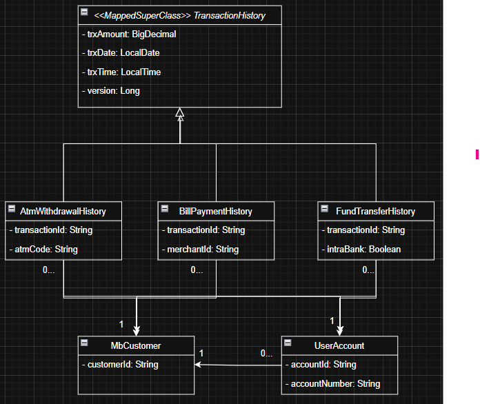
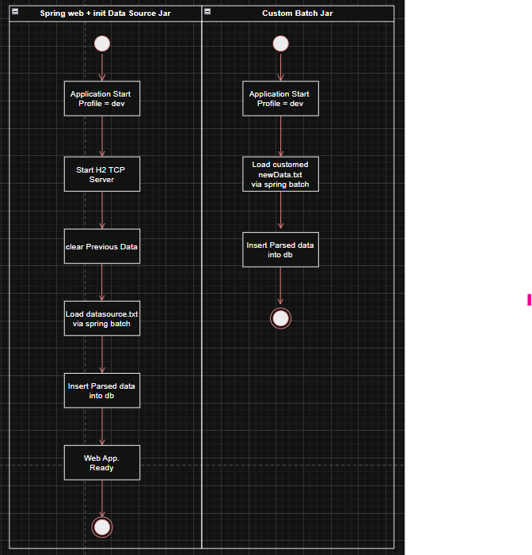

# Spring Boot Batch Data Loader Assessment

## Overview

This is a sample Spring Boot application demonstrating the use of Spring Batch to load and manage data using a
file-based H2 database. It is designed using clean architectural patterns and emphasizes testability and
maintainability. It loads default sample data from `datasource.txt` into an H2 database and supports additional data
loading via batch job invocation.

---

## 1. Setup

### Requirements

- Java 17+
- Maven 3.6+
- Spring Boot
    - Spring Web
    - Spring Batch
    - Spring Security
    - Spring Data JPA
    - Spring Boot Test
- H2 (file-based database)
- Others: Lombok, MapStruct

---

### 1a. Steps to Run

#### Option 1: Using JAR (recommended for deployment)

1. Build the JAR file:

   ```bash
   mvn clean package

2. Start the application (Spring Boot service):

    ```bash
    cd ./target
    mkdir -p ./data
    touch ./data/trxdb.mv.db
    java -jar ./batch-0.0.1-SNAPSHOT.jar

3. In a second terminal (or IDE instance), run the same JAR with a Spring Batch-specific job argument to load additional
   custom data:

    ```bash
    cd ./target
    java -jar ./batch-0.0.1-SNAPSHOT.jar --spring.batch.job.names=customDataLoadJob

`Replace <your-artifact-name> with your actual jar name, e.g., springboot-batch-loader-0.0.1-SNAPSHOT.jar.`

#### Option 2: Using IDE or CLI for Development

```bash
mvn spring-boot:run
```

`You can also run the batch job manually from your IDE using job parameters or a command-line runner configuration.`

## 2. Database Structure

- Database: File-based H2 database.

- Initialization:
    - On every application startup (via either method), a default batch job is executed to load data from
      datasource.txt.
    - The data in the H2 database is cleared on each restart to ensure a consistent initial state.

- Schema:
    - MbCustomer, UserAccount, AtmWithdrawalHistory, BillPaymentHistory, and FundTransferHistory are designed based on
      the content of `datasource.txt`
    - Refer class_diagram below for details.
    - An additional column is included for optimistic locking (@Version).

## 3. Design Patterns & Architecture

### 3a. N-Tier Architecture

#### The project separates concerns into:

1. Controller Layer (HTTP handling)
1. Service Layer (business logic)
1. Repository Layer (data access)
1. Configuration Layer (job and security configurations)

### 3b. Domain-Driven Design (DDD)

#### Core domain logic is encapsulated within the domain layer.

- Data transfer between layers is done via DTOs, with MapStruct for mapping.

## 4. APIs

### 4.1 Class Diagram



### 4.2 Activity Diagram



### 4.3 REST APIs

#### 4.3.1 GET /api/v1/transactions

- Authentication: Basic Auth (admin:admin)
- API Address: GET /api/v1/transactions
- Parameters: `OR junctions will be applied between params `
    - acc_list (optional): List of account numbers to filter
    - cust_id (optional): Customer ID to filter
    - desc (optional): Keyword containing in history description text to search, ignored case
    - page (default=0): Page number for pagination
    - size (default=5): Page size for pagination

- Response Object:

```json
{
  "content": [
    {
      "transactionId": "429dc3ff-adba-44b1-8ab9-9899084fa9cc",
      "trxAmount": 12113.00,
      "description": "BILL PAYMENT",
      "trxDate": "2019-08-11",
      "trxTime": "11:11:11",
      "customerId": "222",
      "accountNumber": "8872838283",
      "version": 0
    }
  ],
  "pageable": {
    "pageNumber": 0,
    "pageSize": 1,
    "sort": {
      "empty": true,
      "sorted": false,
      "unsorted": true
    },
    "offset": 0,
    "paged": true,
    "unpaged": false
  },
  "last": false,
  "totalPages": 14,
  "totalElements": 14,
  "size": 1,
  "number": 0,
  "sort": {
    "empty": true,
    "sorted": false,
    "unsorted": true
  },
  "first": true,
  "numberOfElements": 1,
  "empty": false
}
```

- RESTful Compliance:

    - Resource-based URL
    - Supports filtering and pagination using query parameters
    - Stateless and cacheable

- Error Response:
    - 400 Bad Request
      ```json
      {  "error": "Invalid Param"  }

- Sample curl command

```bash
# GET /api/v1/transactions
curl -u admin:admin "http://localhost:8080/api/v1/transactions?acc_list=12345&cust_id=9876&desc=payment&page=0&size=5"
```

### 4.3.2 PATCH /api/v1/transactions/{id}/description

- Authentication: Basic Auth (admin:admin)
- API Address: PATCH /api/v1/transactions/{id}/description
- Parameters:
    - id (path variable): ID of the transaction to update
    - Request Object:
  ```json
  {"description": "Updated transaction description"}
  ```
    - Response Object:
    ```json 
  {"id": "string","description": "Updated transaction description"}
    ```
    - RESTful Compliance:
        - PATCH is used for partial updates
        - Resource-specific endpoint
    - Concurrency Handling:
        - Optimistic Locking with @Version ensures that updates do not overwrite changes made by concurrent processes.
    - Error Responses:
    - 409 Conflict
    ```json 
      {    "error": "Update Conflict"    }
    ```
    - 404 Not Found
  ```json
    {
    "error": "Entity Not Found"
    }
    ```
- Sample curl command

```bash
# PATCH /api/v1/transactions/{id}/description

curl -u admin:admin -X PATCH "http://localhost:8080/api/v1/transactions/abc123/description" \
-H "Content-Type: application/json" \
-d '{"description": "Updated payment for invoice #456"}'
```

## 5. File Reference

- datasource.txt: The sample data file used for initializing the H2 database on application startup.
- application.yml: Configures the file-based H2 database and Spring Batch settings.

